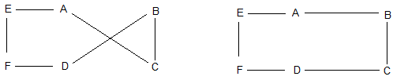

# Simulated Annealing

## What is simulated annealing (SA)?

* Annealing (Literal Meaning) - A metallurgical technique where a material is heated and cooled in a controlled manner to change its physical properties.
* SA is a metaheuristic ⇒ A procedure designed to find a sufficiently good solution to an optimization problem.
* It is used to approximate the global optimum of a function. SA is favoured in situations where the search space is large and discrete.

Some of its applications include:
* The travelling salesman problem (TSP)
* The boolean satisfiability problem (SAT)
* The job - shop problem (JSP)

<p align ="center">

</p>

### Q: How does SA avoid local optima?

A: By sometimes transitioning to states that are less optimal to cover more of the solution space. 
Slow cooling in annealing ⇒ Slow decrease in the probability of transitioning to worse states as more of the solution space is explored.

## Algorithm Overview

A brief explanation of the algorithm:
1. We define a value called *temperature* and set it to some positive value. We also start at some arbitrary state in the solution space.
2. The *temperature* decreases (towards 0) as we perform more iterations / steps.
3. At each step, the algorithm randomly selects a state ‘neighbouring’ the current state. The function we want to optimise for is evaluated at this state. Depending on the whether this value is more optimal or less optimal, and depending on a *temperature*-dependent probability of selecting better / worse states, the algorithm moves to this state.

### Pseudocode:
```python
Let s = s0                                          # Our initial state.
For k = 0 through kmax - 1:                         # Performing kmax iterations.
    T ← temperature(1 - (k + 1) / kmax)             # temperature(r) (↓ w/ ↓ in r).
    Pick a random neighbour, snew ← neighbour(s)    # Selecting a random neighbouring state.
    If P(E(s), E(snew), T) ≥ random(0, 1):          # If accepted, move to this state.
        s ← snew
Output s                                            # Our final state after kmax iterations.
```

 - **E(s)** refers to the value of the function we are optimising for at a particular state **s**.
 - **P** is a function estimating the probability of acceptance, which is dependent on the temperature and the values of the function we are optimising for, evaluated at the current and neighbouring states (check the next slide).

### The Acceptance Probability Function:

As stated earlier, this function estimates the probability of transitioning to a random neighbouring state, given the temperature and the values of the function we are optimising for, evaluated at the current and neighbouring states.

#### Implementation?

In the case of a naive algorithm such as hill-climbing (where we only keep transitioning to better states), we would use something along the lines of:
```python
if (E(neighbour) better than E(current) return 1.0 else return 0.0
```

However,  SA requires us to sometimes transition to worse states depending on the temperature. One of the most commonly used probability acceptance functions used here corresponds to the Metropolis-Hastings algorithm:
```python
if (E(neighbour) better than E(current) return 1.0 else return e(-abs(E(neighbour) - E(current) / curTemp)
```
A few things can be noted here. Firstly, there is a non-zero probability of transitioning to a better state. Secondly, as the temperature decreases, the probability of transitioning to a worse state also decreases.

## SA in the context of TSP

* Overview: The travelling salesman problem (TSP) is an NP-hard problem. We can phrase it in the following manner: 
```
Given an undirected (generally complete) weighted graph, what is the shortest possible path that visits each node exactly once and returns to the original starting node?
```
* Solution (State) Space: The permutation (order) in which the nodes are visited. Note that the solution space is discrete and blows up with large n (in particular, there are (n - 1)! distinct states), an ideal scenario for using SA.
* Function (to be optimised): The sum of the cost of each edge traversed in the path. We are interested in minimising this.

### Neighbouring States

<p>One important property of a neighbouring state is that it should not differ too much from the current state.</p>

<p>Suppose we visit the vertices in a particular order (the permutation gives us the current state). Now, if we reverse some random subarray within this permutation, we arrive at a neighbouring state.</p>

<p>This method of picking neighbouring states is termed as 2-opt optimisation, and is quite well known.</p>


<p>In a more visual sense, this corresponds to taking a route that crosses over itself and reordering it so that it does not.</p>

<p align ="center">

</p>

### Code Details

In the [code](simulatedAnnealing.ipynb), I've simulated the solving of TSP for 100 random nodes in a 3D space, by performing 4000 iterations of simulated annealing. You can observe a decrease in the sum of the paths chosen as the number of iterations increase.

<video src="https://user-images.githubusercontent.com/67233931/182415199-8961870a-2ed0-4c03-9260-53152e8c04fb.mp4"></video>


## Advantages & Limitations

| Advantages                                                                                                                             | Limitations                                                                                                                                               |
|----------------------------------------------------------------------------------------------------------------------------------------|-----------------------------------------------------------------------------------------------------------------------------------------------------------|
| Simulated Annealing is heavily generalised and can be extended very easily to arbitrary optimisation problems.                         | Simulated Annealing is generally quite slow in comparison to other techniques, especially when the function to be optimised is expensive to compute.      |
| It generally gives a good solution (particularly when multiple runs are made), and is fairly simple to code even for complex problems. | Simpler and faster methods such as gradient descent often work better in scenarios where there are very few local minima (i.e. SA is sometimes overkill). |
| SA statistically guarantees finding an optimal solution.                                                                               | Although SA may approach an optimal solution, the algorithm cannot explicitly tell whether it has found an optimal solution.                              |
|                                                                                                                                        | SA is quite generalised, and may be inferior to problem-specific heuristics.                                                                              |

## References

* https://en.wikipedia.org/wiki/Simulated_annealing
* https://codeforces.com/blog/entry/94437
* http://www.new-npac.org/projects/cdroms/cewes-1999-06-vol1/cps615course/csematerials/applications/mc/montecarlo/node139.html
* http://www.new-npac.org/projects/cdroms/cewes-1999-06-vol1/cps615course/csematerials/applications/mc/montecarlo/node140.html
* https://github.com/chncyhn/simulated-annealing-tsp
* https://en.wikipedia.org/wiki/2-opt
* http://pedrohfsd.com/2017/08/09/2opt-part1.html
